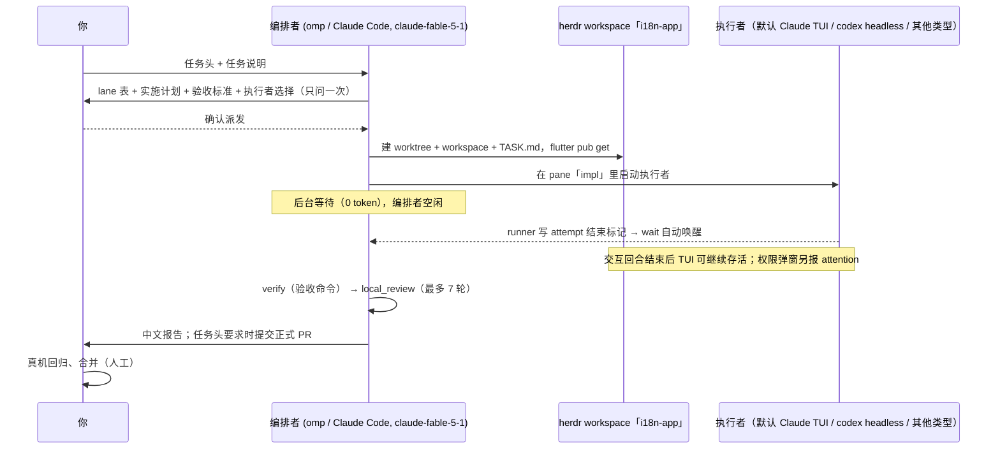

# lane-dispatch 使用指南：以「Flutter App 增加一种语言」为例

> 适用 v0.5：让 Claude（omp 或 Claude Code，Fable 5.1 / Opus 5.5）当编排者，按类型选择 omp / claude / codex / grok / pi 执行者（默认 Claude Opus 5.5 的交互式 TUI；codex 默认 headless，可用预设改成 codex TUI），在示例仓库 `my-app` 里完成一个功能任务，最后自动验收、由 codex review 并按任务要求提交 PR。安装了 `local_review` skill 时 review 使用该 skill；提示词本身要求分级报告和 `DECISION:` 行。
> 编排者遵循的规则见 `skills/lane-dispatch/SKILL.md`，安装和配置见 `README.md`。本文只讲**你怎么用**。

---

## 1. 一张图看懂



---

## 2. 一次性准备（已完成的项可跳过）

下文 `<code-root>` 指你本机存放项目仓库的目录（例如 `~/Developer/code`），`<lane-dispatch>` 指本仓库的 clone 目录。示例使用内置分支规则：`feature` 和 `fix` 都以 `main` 为目标。

|检查项|命令|期望|
|---|---|---|
|在 herdr pane 里|`echo $HERDR_ENV $HERDR_PANE_ID`|`1 wX:pY`|
|skill 已安装|插件方式：Claude Code / omp 的插件列表里有 `lane-dispatch`；软链接方式：`ls -la ~/.agents/skills/lane-dispatch ~/.claude/skills/lane-dispatch`|能看到 `lane-dispatch` 及各类型入口（安装方式见 README）|
|Claude Code 可交互运行（默认执行者）|`claude --version`；在主 checkout 中启动 `claude`|CLI 可用、已完成登录，并由你确认主 checkout 的目录信任|
|codex 可用且已登录（review 必需；`sol` 执行者也用它）|`codex --version`；首次使用先完成 codex 登录|版本可用且凭据已配置；版本命令本身不证明已登录|
|其他执行者（按需）|`omp --version` / `pi --version` / `grok --version`；只检查要选的类型|CLI 可用、所需模型 / 账号已配置；选这些类型还需逐 lane 批准 yolo|
|交互执行者的 herdr hooks 可用|`herdr integration status`；执行者启动后查看 `herdr agent get <pane>`|所选类型的集成为 `current`；能报告 working / idle / done / blocked|
|gh 已登录且有仓库推送权限|`gh auth status`|已登录，并有目标仓库的 push 权限|

主 checkout 停在哪个分支都没关系。lane 的基线由 `kind` 的分支规则决定，不看当前分支，也不会动主 checkout 里未提交的改动。

Claude 的新 worktree 仍可能出现目录信任对话框。只有 `~/.claude.json` 已记录你信任该 lane 的**主 checkout**，runner 才会自动代答一次；否则以 attention 通知你，需你在 pane 中确认。先信任主 checkout 不等于给任意新仓库授权。grok 需要先登录（`grok login`），未登录时 attempt 会以 `never_started` 结束。

---

## 3. 启动编排者

在任意 herdr pane 里（建议单独开一个 `orchestrator` tab）：

```bash
omp --model claude-fable-5-1
# 或
claude-herdr --model claude-fable-5-1
```

拿不到 `claude-fable-5-1` 时用 `claude-opus-5-5`。编排者所在的 pane 就是通知目标：没有 waiter 在等、且该 pane 的 agent 状态是 idle / done 时，runner 会在 attempt 结束或需要介入时发「Resume lane-dispatch run …」门铃；磁盘事件始终保留，不依赖门铃送达。

---

## 4. 发给编排者的任务（直接复制改写）

```text
使用 lane-dispatch skill 执行下面的任务。

【任务头】
- 仓库：<code-root>/my-app
- kind：feature（内置规则：基线 origin/main，PR → main）
- 发布：完成后提交正式 PR
- 沙箱：safe；构建被沙箱挡住时先问我再切 yolo
- 执行者：claude（类型名，内置默认为 opus）；也可写预设 opus / sol，或类型 omp / codex / grok / pi。选择 omp / grok / pi 时，需要我对此 lane 明确批准 yolo

【任务】
为 Flutter App 增加西班牙语（es）：新增翻译文件、注册到支持的语言列表，
缺失的翻译回退英文，补上语言切换的测试。
```

**任务头决定三件事：**

- **发布**：写「提交正式 PR」时，lane 的 `publish` 为 `pr`；不写就只保留本地分支（默认）。
- **kind**：内置规则中，`feature` 建 `feature/<slug>` 分支、使用 `feat` 提交类型，`fix` 建 `fix/<slug>` 分支、使用 `fix` 提交类型；两者都基于 `main` 并向 `main` 提 PR。仓库用别的分支模型时在 `config.json` 的 `kinds` 里改。
- **执行者与沙箱**：类型或预设决定执行方式；不支持 safe 的类型必须先获你对本 lane 的 yolo 批准。

---

## 4.1 执行者怎么选、默认值怎么改

编排者每次派发前都会问你一次（和计划确认放在同一个问题里），先按类型分类，再选该类型下的预设：

|类型|内置默认预设 / 模型|模式|沙箱|
|---|---|---|---|
|`omp`|`omp-opus` / `anthropic/claude-opus-5-5`|仅 interactive，真实 omp TUI|无 lanectl 可保证的 OS 沙箱；仅 yolo，需逐 lane 批准|
|`claude`|`opus` / `claude-opus-5-5`（全局默认）|默认 interactive；可显式设 headless|safe：Claude sandbox + `acceptEdits` + 工具白名单 + `--add-dir`；也可获批后 yolo|
|`codex`|`sol` / `gpt-6-sol`|默认 headless（`codex exec`）；预设设 `"mode": "interactive"` 时是真实 codex TUI|safe：`workspace-write`（两种模式相同）；也可获批后 yolo|
|`grok`|`grok-4.6` / `grok-4.6`|仅 interactive，真实 grok TUI|当前仅 yolo；safe 被拒|
|`pi`|`pi-gpt` / `openai-codex/gpt-5.5`|仅 interactive，真实 pi TUI|无 OS 沙箱 / 权限系统；仅 yolo|

内置预设的 effort 都是 xhigh。spec 的 `"executor": "claude"` 会按 `defaults.claude` 解析，`"executor": "opus"` 则直接指定预设；不指定执行者或回答「默认」，就用全局 `executor`（内置为 `opus`）。**omp / pi / grok 配 `sandbox: "safe"` 会在 `new` 或 `set-executor` 被拒**，不能因为选了类型就默认获得 yolo 授权。grok 的 `--sandbox workspace` 目前不能加入 lane / git 公共目录；需要合适的自定义 `sandbox.toml` profile 和实现支持后才能考虑 safe。

也可直接用分类入口 `/lane-dispatch-omp`、`/lane-dispatch-claude`、`/lane-dispatch-codex`、`/lane-dispatch-grok`、`/lane-dispatch-pi`。它们固定执行者类型，仍交给主 skill 做计划确认、沙箱审批和验收。review 始终由 codex 负责，与执行者无关；有 `local_review` skill 时使用它。

想改**全局默认值**、**类型默认预设**或加预设，就建 `~/.agents/lane-dispatch/config.json`（没有这个文件就用内置默认）：

```json
{
  "executor": "opus",
  "defaults": {
    "claude": "fable",
    "codex": "sol",
    "omp": "omp-opus"
  },
  "executors": {
    "fable": {"provider": "claude", "model": "claude-fable-5-1", "effort": "xhigh"},
    "opus-headless": {"provider": "claude", "model": "claude-opus-5-5", "effort": "xhigh", "mode": "headless"}
  }
}
```

这个例子中，不指定 executor 仍选 `opus`，指定类型 `claude` 则选 `fable`；指定预设 `opus-headless` 才使用 `claude -p`（`mode: "headless"`）。若希望所有未指定执行者的 lane 也用 fable，再把全局 `"executor"` 改成 `"fable"`。`defaults` 可覆盖五种类型的映射，值必须是相同 provider 的预设；预设省略 mode 时采用该类型的默认模式。codex 可设 `"mode": "interactive"`（例：`"sol-tui": {"provider": "codex", "model": "gpt-6-sol", "mode": "interactive"}`），omp / pi / grok 不能设 headless。

改完用 `$L config`（`$L` 的路径见 README「安装」）查看生效配置；输出包含 `kinds`，以及按类型列出 `presets`、`default`、`modes`、`safe_sandbox`、`installed` 的 `types`。`installed` 只表示 PATH 中存在命令，不证明已登录。reviewer 只能是 codex，配置成别的会报错。设置 `LANE_DISPATCH_HOME` 时，配置和 runs 目录改从该路径读取；`start` 会把它透传给 pane 中的新 runner。

分支规则：`config.json` 的 `kinds` 可新增或覆盖，每条需完整提供 `target`、`prefix`、`commit`，可选 `confirm` 和 `local_only`。详见 README「配置分支规则（kind）」。

---

## 5. 编排者会产出的 lane spec（你确认的就是它）

编排者读代码后写 `~/.agents/lane-dispatch/runs/<run>/specs/i18n-app.json`，确认环节会给你展示。下面使用内置分支规则；文件名、计划细节和验收命令按你的 Flutter 项目调整，路径占位符需替换为实际路径：

```json
{
  "lane": "i18n-app",
  "repo": "<code-root>/my-app",
  "kind": "feature", "slug": "add-spanish-locale", "publish": "pr", "sandbox": "safe", "executor": "claude",
  "objective": "Add Spanish (es) language support to the Flutter app",
  "plan": "1. 参照现有 ARB 模板创建 lib/l10n/app_es.arb，保持键一致。\n2. 更新应用支持的语言列表并重新生成本地化代码。\n3. 缺失翻译回退英文，补语言切换测试。",
  "checklist": ["Spanish ARB + regenerated localizations", "supported locale list",
                "locale switch + fallback tests", "acceptance passes, committed"],
  "acceptance": [
    {"cmd": "flutter gen-l10n && git diff --exit-code -- lib/l10n"},
    {"cmd": "git ls-files '*.dart' | grep -vE '\\.(g|freezed)\\.dart$' | xargs dart format --output=none --set-exit-if-changed"},
    {"cmd": "flutter analyze --no-fatal-infos --no-fatal-warnings"},
    {"cmd": "flutter test --no-pub"}
  ],
  "setup": ["flutter pub get --enforce-lockfile"],
  "writable": ["~/.pub-cache", "<flutter-sdk>/bin/cache", "~/.dartServer"],
  "pr_title": "feat(i18n): add Spanish (es) language support"
}
```

写 spec 时要注意：

- **执行者可写类型或预设**：例子中的 `claude` 跟随 `defaults.claude`；要固定内置 Opus 5.5 就写 `opus`。配置示例中的 fable 覆盖会影响这个 spec。
- **验收命令不能改动工作区**：verify 会检查验收前后 HEAD 不变、仍在 lane 分支、工作区 clean。所以格式检查用 `dart format --output=none`，不能用会改写文件的 `dart format`。生成文件用「重新生成 + `git diff --exit-code`」证明是最新的。
- **setup 在沙箱外执行**：依赖安装放在这里；项目需要 build_runner 时也在 setup 中添加对应命令。`writable` 是执行者构建时要写的缓存目录；将 `<flutter-sdk>` 替换为实际 SDK 路径，其 `bin/cache` 是否够用要在第一次 pilot 时确认，被挡住就会上报给你，由你决定是否对这条 lane 开 yolo。
- **Android / iOS 原生单测**：按项目实际存在的 Gradle / Xcode 测试命令加入验收；示例不假设你的仓库已有特定测试类。未执行的原生测试和真机回归应在报告里明确标成「未跑」。

---

## 6. 执行中你能看到什么

|看什么|在哪里|
|---|---|
|执行者真实 TUI（Claude 默认、omp / pi / grok、显式 interactive 的 codex）|herdr 侧边栏的 workspace `i18n-app` → pane `impl`；可看完整对话、工具操作，也可直接输入|
|headless 输出（codex 默认、显式 headless 的 Claude）|同一 pane；Claude 的文本和 `→ 工具 参数` 行只是 runner 渲染，不是 TUI|
|进度|`~/.agents/lane-dispatch/runs/<run>/lanes/i18n-app/progress.md`|
|整体状态|`$L status <run>`|
|每次 attempt 的提示 / 结果|交互模式有 `attempt-N.prompt.md`、`result-draft-N.json`；`report` 校验后写 `result-N.json`；结束事件是 `attempt-N.exit`|
|日志 / 需介入的屏幕|headless 有 `attempt-N.log`；交互模式看 pane，attention 的 `screen_tail` 或非 report 结束标记的 `screen` 保留可见屏幕|
|review 报告|同一目录下的 `review-N-<token>.md`（代码块之外有一整行 `DECISION: …`）|
|代码|`<code-root>/.codex-worktrees/<run>/my-app-i18n-app`|

交互执行者按提示文件的要求提交 `report`，runner 在 herdr 显示回合结束后写 exit 标记。TUI 和 runner **不必退出**，下一次续跑可以复用它们；`result-N.json` 也只是结果声明，仍要 verify / review 才能完成 lane。

你可以在 TUI 里回答当前对话框或补充当前任务，但不能以手动对话代替编排者的计划变更确认、正式续跑和门禁。需要新 attempt 时交给编排者执行 `start`，不要往仍开着的 TUI 输入 `lanectl` shell 命令。

编排者后台等待期间没有 LLM 轮询：`wait` 每 5 秒查磁盘，交互 runner 每 2 秒查 herdr 状态。遇到权限 / 信任弹窗会返回 `attention: "blocked"`，lane 仍 `running`；编排者通知你处理，再挂回 `wait`。正常结束则由 `attempt-N.exit` 唤醒编排者、转为 `judging`。

---

## 7. 什么时候需要你

|时刻|你做什么|
|---|---|
|计划确认（只问一次）|看 lane 表、实施计划、验收标准，回复「派发」或指出要改的地方|
|`attention: "blocked"`（权限 / 信任弹窗）|根据 `screen_tail` 到 lane pane 处理对话框；这是正在运行的同一 attempt，不是让编排者重新 `start`|
|`via: "never_started"`（如登录页）|提示送达后 180 秒仍没开始工作且没有 blocked 状态时触发；查看屏幕、完成登录或修复启动条件，再让编排者续跑。它不是任务成功；runner 会停掉该 TUI|
|`via: "lost"`|runner 被硬杀（SIGKILL、崩溃）。`wait` 已停掉残留的执行者并修复 pane 终端；事件带 `orphan` 时说明还有进程没停掉，先到 lane pane 里结束它，编排者再续跑|
|结果 `status: "blocked"` 且超出计划（不是 attention）|回答问题；编排者会用 `--user-answer` 记下你的原话再续跑|
|构建被沙箱挡住，或要选择 omp / pi / grok|决定是否明确批准这条 lane 使用 yolo；不按类型批量豁免|
|local_review 第 7/7 轮仍不通过|`HUMAN_CONFIRMATION_REQUIRED`：决定修、缩范围还是停|
|PR 提交后|按项目流程做 iOS / Android 真机回归、人工 review、合并|

**上限**（由脚本强制，编排者绕不过）：

- 同时运行的 lane ≤ 4；
- 每条 lane 续跑 ≤ 3 次；
- review ≤ 7 轮（修复 ≤ 6 次）；
- 单条 lane 总 attempt ≤ 14。

---

## 8. PR 长什么样

发布前，编排者按目标仓库已有的 PR 模板写 `pr.md`；没有模板时可使用 `lanectl publish` 生成的默认正文。内容应包括：

- 变更摘要，以及相关计划、跨仓 PR 链接（如有）；
- 实际执行的验收命令和结果；
- codex review 的轮次、分级原文和 `DECISION:` 结论；
- agent 来源说明；
- 尚未执行的验证，例如「真机回归待人工」，不能提前勾成通过。

推送用显式 refspec、不 force。如果同分支已经有一个 open PR 且目标一致，就更新它的正文，不新开 PR；目标不一致时在推送前就报错。PR 创建后目标分支（本例为 `main`）如果又前进了，按 verify → review → publish 重走一遍。

合并由你来做，使用仓库要求的 merge style；lanectl 不替你执行合并。

---

## 9. 中断与恢复

- **编排者会话关掉了**：lane 仍在 herdr pane 里继续跑。新开一个编排者，说「resume lane-dispatch run <run>」即可。它会执行 `lanectl runs` 和 `lanectl status <run>`，重新挂上等待；已经落盘的 exit / 尚未处理的 attention 会被识别，不需要记得上次聊天说到哪里。
- **交互 agent 还活着，只是本回合结束**：编排者 `start` 下一 attempt 后，原 runner 用 launch token 确认并以 `herdr agent prompt` 投递新提示。不要关闭 TUI 或向其中粘贴启动 shell 命令。`Ctrl+C` 交给 TUI，不会直接终止 runner。
- **agent 已退出**（如 Claude `/exit` 或崩溃）：尚未结束的 attempt 会收到 `via: "exited"`；若本回合已经落盘，则保留原事件。编排者处理事件后，下次 `start` 启动新 runner、恢复同一 session（Claude / grok 用 `--resume`，omp 用原 session 目录 + `--continue`，pi 用原 `--session-id`，codex TUI 用 `codex resume <thread id>`）；codex headless 仍用 `exec resume`。
- **需要换执行者**：只能在 attempt 之间切换；若旧 TUI 还开着，先在 pane 退出旧 agent，再让编排者用 `set-executor`。切换后从新 session 读取 TASK.md / progress.md，不会跨类型复用对话。
- **执行者额度用完或模型繁忙**（如 `Selected model is at capacity`）：编排者结合 headless 的 `log_tail` 或交互模式的屏幕 / 结果判断，再用 `--reason ratelimit --after <分钟>` 延时续跑；权限对话框的 attention 仍须在当前 attempt 内处理。

---

## 10. 收尾

**workspace 自动关闭**：所有 lane 都到了 `published`、`ready`、`failed` 或 `abandoned` 之后，编排者会在报告之后执行 `lanectl close <run>`。

- 只关本次 run 新开的 workspace，只关已结束的 lane；关之前核对 pane 仍在该 lane 的 worktree 里，herdr 重启后 id 被复用的不会误关。
- 已经不存在的 workspace 只做记录。
- 运行中、审核中、escalated 的 lane 一律保留。

PR 之后还要改（比如 review 意见）时，用 `lanectl reopen <run> <lane>` 在原 worktree 上重开一个 workspace。

**下面两条仍由你执行**，编排者只打印命令：

```bash
git -C <code-root>/my-app worktree remove <worktree>  # 确认工作区干净且不再需要后执行；有未提交改动时 Git 会拒绝
gh pr merge <number> --delete-branch                # 人工 review、真机回归后，按提示选择仓库要求的 merge style
```

---

## 11. 同一任务涉及多个仓库

如果同一个需求还要改其他仓库（例如后端接口或 Web 前端），每个仓库可以是一条 lane，放在同一个 run 里，最多同时跑 4 条。各仓库使用自己的路径、验收命令和 PR 模板；合并顺序由实际依赖决定，例如先合入被依赖的接口改动，没有依赖的 lane 不需要人为排队。
